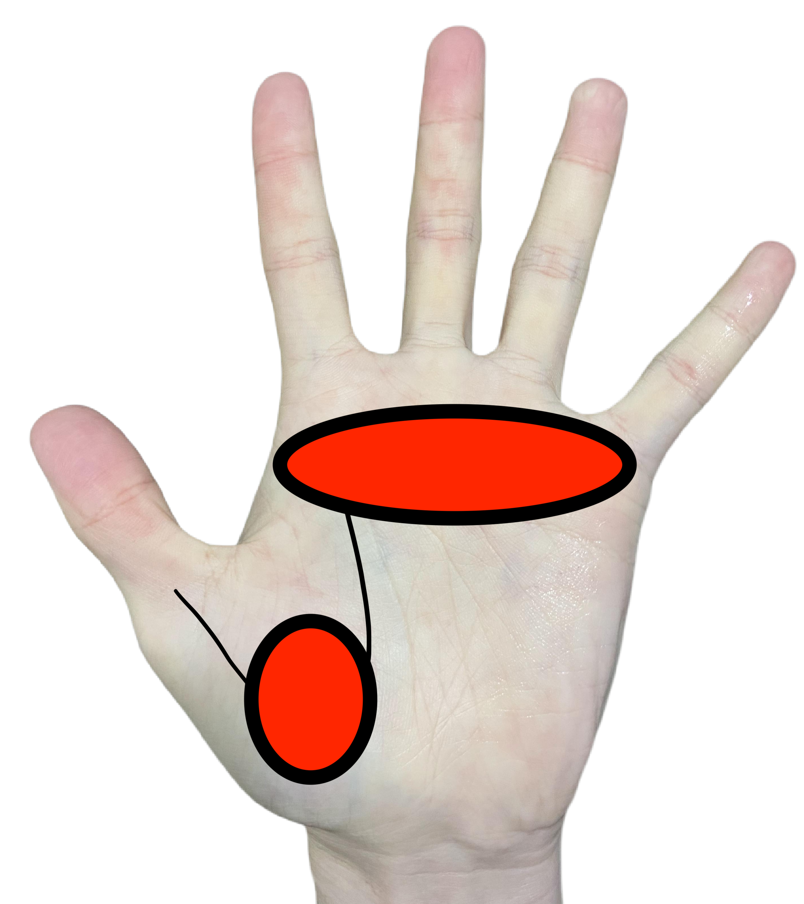
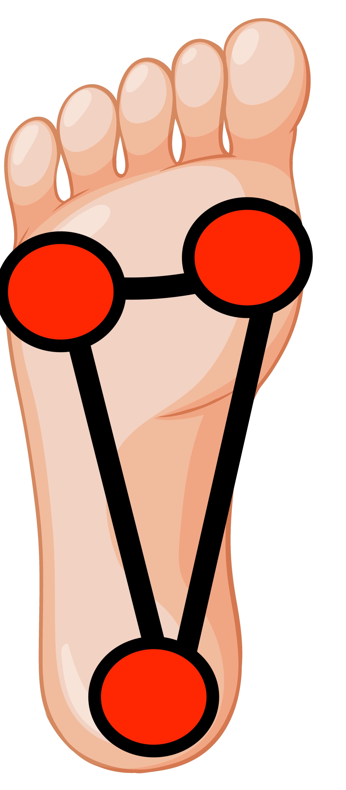
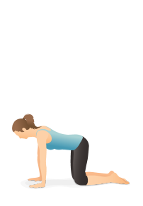
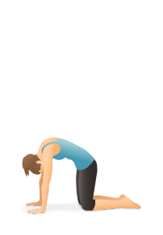
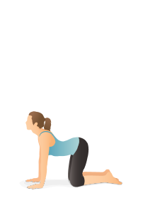
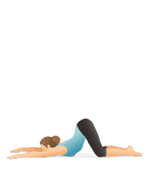
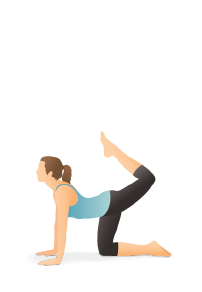

# 第2周：建立根基 (Grounding)-四角板凳式详解加流动

**导言**：我们尝试通过简单的四角板凳和下犬式，感受从手掌和脚掌建立起与大地相连的根基。并且从山式开始，感受如何将这个根基传递到全身。感受器官的支撑，稳定和空间。

---

## A. 理论精讲：呼吸与根基 (Theory & Anatomy)

### 1 建立手掌的支撑，感受大臂内侧的激活：
手掌的虎口、五个手指的指根与地面接触。大臂微微外旋，激活大臂内侧，这样可以将力量不费力地从肩胛骨传导到手掌再到地面。

- 从四角板凳式开始感受手掌的支撑。
- 到四角板凳式抬起单侧的手或者脚，感受手掌或者脚掌的支撑。身体其他部位的稳定和伸展。
- 第二节课开始从四角板凳式过渡到下犬式，感受手掌的支撑，手臂力量的建立。
- 第二节课感受单腿下犬式，感受手掌的支撑，手臂力量的建立。

### 2 建立脚的支撑，感受腿部的激活：
脚后跟、小脚趾根部、大脚趾根部形成的三角形与地面稳稳扎根。站立时体会大腿内、外、后侧的全面激活（尤其是经常被忽视的大腿内侧）。

- 从山式站立开始找到稳定的感觉，找到前后左右移动重心的感觉。
- 从山式过渡到战士一式，感受脚掌的支撑，大腿内侧的激活。
- 从战士一式过渡到战士二式，感受脚掌的支撑，大腿内侧的激活。
- 从战士二式过渡到三角式，感受脚掌的支撑，大腿内侧的激活。

## B. 核心体式与流 (Core Asanas & Flow)

### 根基练习

- **四角板凳 (Box)**：感受到身体的器官自然地被支撑住。身体后侧保持水平。

### 核心体式

- **猫式 (Cat Pose)**：

- **牛式 (Cow Pose)**：

- **大猫伸展式 (Puppy Pose)**：

- **虎式 (Tiger Pose)**：

### 推荐串联流 (Vinyasa Flow)
> **简单支撑和站立拉伸基础流 (Simple Support and Standing Stretching Flow)**
> 关注点：把呼吸带入到体式中，感受每个呼吸带来的身体的细微变化。

---

## C. 实践与辅助工具 (Practice Tools)

### 练习大纲清单
- [ ] 简单盘腿坐立：观察呼吸。

<!-- ### 🎬 精华视频 (10-min Deep Dive)

  <iframe src="https://www.youtube.com/embed/dQw4w9WgXcQ" frameborder="0" allowfullscreen></iframe>

### 🎵 推荐音乐 (Spotify 播放列表)
<iframe style="border-radius:12px" src="https://open.spotify.com/embed/playlist/37i9dQZF1DWZqd5JICZI0u?utm_source=generator" width="100%" height="352" frameBorder="0" allowfullscreen loading="lazy"></iframe>

 -->