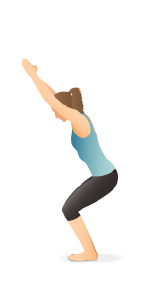

# 第3周：建立根基 (Grounding)-站立体式详解

**导言**：我们尝试通过简单的四角板凳和下犬式，感受从手掌和脚掌建立起与大地相连的根基。并且从山式开始，感受如何将这个根基传递到全身。感受器官的支撑，稳定和空间。

---

## A. 理论精讲：建立脚的支撑，感受腿部的激活

脚后跟、小脚趾根部、大脚趾根部形成的三角形与地面稳稳扎根。站立时体会大腿内、外、后侧的全面激活（尤其是经常被忽视的大腿内侧）。

## B. 核心体式与流 (Core Asanas & Flow)

- 从山式站立开始找到稳定的感觉，找到前后左右移动重心的感觉。
- 从山式过渡到战士一式，感受脚掌的支撑，大腿内侧的激活。
- 从战士一式过渡到战士二式，感受脚掌的支撑，大腿内侧的激活。
- 从战士二式过渡到三角式，感受脚掌的支撑，大腿内侧的激活。

### 根基练习

- **山式 (Tadasana)**：所有体式的起点。闭眼感觉微小晃动中的平衡。

- **幻椅式 (Chair Pose)**：

### 核心体式

- **高弓步式 (High Lunge)**：注意当你的力量不够时，身体还没准备好时，弯曲的前腿大腿可以不与地面垂直，但是小腿必须与地垫垂直。后脚的脚尖也超前。后脚脚跟可以抬起。我们主要感受锻炼的是前腿的伸展。
腹股沟不要被挤压，尾骨轻轻向下向前卷曲，使得骨盆水平。
吸气向上伸展脊柱，呼气向下把力量传导到前脚掌和后脚脚尖。在一吸一呼里找到一个比较深入又可以平稳呼吸的位置停留。

- **战士一式 (Warrior I)**：当你的高弓步的后脚脚跟慢慢可以放到地垫上以后。（往往可能此时你的后脚尖无法弯曲超前，与前方可能有一个小的角度也可以）。我们就来的了战士一式。同样我们利用呼吸让身体慢慢在浮动中找到平衡和伸展的状态。

- **战士二式 (Warrior II)**：战士一式里的后脚脚尖向外转90度，身体的侧面打开，前脚保持不变。前后脚的移动主要是让你感受到身体侧面的打开和空间。吸气向上伸展脊柱，呼气时把力量传导到前后脚掌。感受身体在浮动中慢慢找到平衡和伸展的状态。
双手从身体中心开始，向两侧打开，直到手臂平行于地面，手臂无需绷直，但是感受到这种细微调整下的动态平衡。

- **侧角伸展式 (Extended Side Angle Pose)**：战士二式的基础上，后腿稍微发力，身体向着前腿的方向侧弯，前面的手臂放在小腿上或者手肘放在大腿上，上面的手臂由前侧向上举起，与地面平行。注意重量不是向下压在大腿或者膝盖上的，而是有一种用手臂向上捋大腿的肉的提升的感觉。

如果想要加强，可以尝试把手放在弯曲腿前侧的砖块或者地垫上。

- **三角式 (Triangle Pose)**：战士二式的基础上，后腿稍微发力，上半身向着前腿的方向移动和伸展，大概到了极限位置后，弯曲上半身，双手从身体的中心开始向上下两个方向同时拉伸。吸气，上半身继续向上。呼气，下半身更加扎根。可以在下方放瑜伽砖或者碰到地垫

- **金字塔式 (Pyramid Pose)**：三角式的基础上，我们面向垫子的短边，来到我们类似前屈的金字塔式。跨摆正，也就是骨盆的中立位。吸气，脊柱向上拉伸。呼气，把身体带向大腿的一侧，可以在腿两侧放置瑜伽砖，作为支撑。感受身体后侧的伸展和前腿内侧的伸展。

### 挑战平衡体式
- **虎式 (Tiger Pose)**：

- **幻椅式扭转 (Twisted Chair Pose)**：

### 推荐串联流 (Vinyasa Flow)
> **简单支撑和站立拉伸基础流 (Simple Support and Standing Stretching Flow)**
> 关注点：把呼吸带入到体式中，感受每个呼吸带来的身体的细微变化。

---

## C. 实践与辅助工具 (Practice Tools)

### 练习大纲清单
- [ ] 山式 (Tadasana)：闭眼感受微小晃动中的平衡。

<!-- ### 🎬 精华视频 (10-min Deep Dive)

  <iframe src="https://www.youtube.com/embed/dQw4w9WgXcQ" frameborder="0" allowfullscreen></iframe>

### 🎵 推荐音乐 (Spotify 播放列表)
<iframe style="border-radius:12px" src="https://open.spotify.com/embed/playlist/37i9dQZF1DWZqd5JICZI0u?utm_source=generator" width="100%" height="352" frameBorder="0" allowfullscreen loading="lazy"></iframe>

 -->